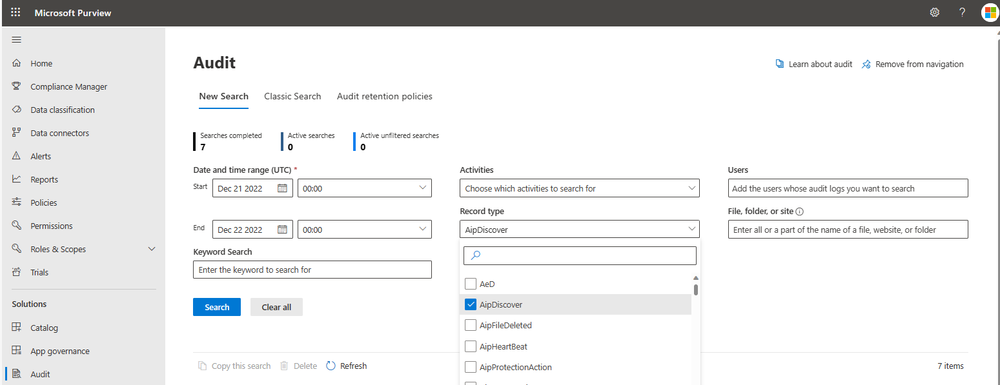
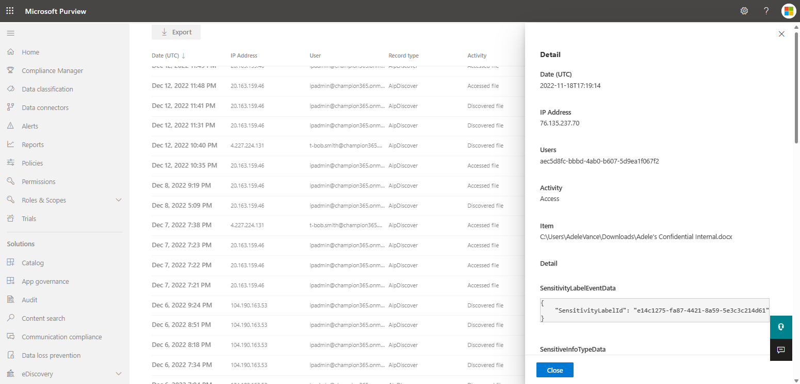

# AipDiscover

Azure Information Protection is a service that allows organizations to classify and label sensitive data, and apply policies to control how that data is accessed and shared.

AipDiscover is a type of event that is recorded in the Office 365 Unified Audit Log. It represents an attempt to discover or access an Azure Information Protection (AIP) protected file. In the scenario in which an AIPDiscover event shows the operation as discover that means the file has been listed within an on-premise file share, SharePoint server, etc. that is being viewed by a user or information protection scanner and the state of the file is at rest. In the scenario that an AIPDiscover event shows the operations as access that means the file has been opened and is in use by the user when the event was recorded.

The AIPDiscover event is useful because it shows the users, devices, and locations that are accessing Azure Information Protection labeled information within an organization.

## Access the Office 365 Unified Audit Log

The audit logs can be accessed using the following methods:

- The [Audit Log search tool](#audit-log-search-tool) in the Microsoft Purview compliance portal.
- The [Search-UnifiedAuditLog](#search-unified-audit-log-in-powershell) cmdlet in Exchange Online PowerShell.
- The [Office 365 Management Activity API](#office-365-management-activity-api).

To view descriptions of the data fields within an audit event, see [Attributes of an AipDiscover event](#attributes-of-the-aipdiscover-event)

### Audit log search tool

1. Go to the [Microsoft Purview compliance portal](https://sip.compliance.microsoft.com/homepage) and sign in.
2. In the left pane of the compliance portal, select **Audit**.
   > [!Note]
   > If you don't see **Audit** in the left pane, see [Roles and role groups in Microsoft Defender for Office 365 and Microsoft Purview compliance](/microsoft-365/security/office-365-security/scc-permissions?view=o365-worldwide&preserve-view=true) for information about permissions.
3. On the **New Search** tab, set Record type to **AipDiscover** and configure the other parameters.

4. Click **Search** to run the search using the criteria. In the results pane, select an event to view the results. Both discover and access operations can be viewed.


For more information on viewing the audit logs in the Microsoft Purview compliance portal, see [Audit log activities](/microsoft-365/compliance/audit-log-activities).

## Search Unified Audit Log in PowerShell

To access the Unified Audit Log using PowerShell, first connect to an Exchange Online PowerShell session by completing the following steps.

### Establish a remote PowerShell session

This will establish a remote PowerShell session with Exchange Online. Once the connection is established, you can run Exchange Online cmdlets to manage your Exchange Online environment.

Open a PowerShell window and run the Install-Module -Name ExchangeOnlineManagement command to install the Exchange Online Management module. This module provides cmdlets that can be used to manage Exchange Online.

1. Connect-IPPSSession is a PowerShell cmdlet used to create a remote connection to an Exchange Online PowerShell session.
2. Import-Module ExchangeOnlineManagement is a PowerShell cmdlet used to import the Exchange Online Management module into the current PowerShell session.

```powershell
# Import the PSSSession and Exchange Online cmdlets
Connect-IPPSSession
Import-Module ExchangeOnlineManagement
```

#### Connect with a specific user

Command to prompt for a specific user for your Exchange Online credentials.

```powershell
$UserCredential = Get-Credential 
```

Command to connect to Exchange Online using the provided credentials.

```powershell
Connect-ExchangeOnline -Credential $UserCredential -ShowProgress $true 
```

#### Connect with credentials in the current session

Connect to Exchange Online using the credentials in the current session.

```powershell
Connect-ExchangeOnline
```

## Search-UnifiedAuditLog cmdlet

The Search-UnifiedAuditLog cmdlet is a PowerShell command that can be used to search the Office 365 Unified Audit Log. The Unified Audit Log is a record of user and administrator activity in Office 365 that can be used to track events. For best practices on using this cmdlet, see [Best Practices for using Search-UnifiedAuditLog](aip-unified-audit-logs-best-practices.md).

To extract the AipDiscover events from the Unified Audit Log using PowerShell, you can use the following command. This will search the Unified Audit Log for the specified date range and return any events with the record type "AipDiscover". The results will be exported to a CSV file at the specified path.

```powershell
Search-UnifiedAuditLog -RecordType AipDiscover -StartDate (Get-Date).AddDays(-100) -EndDate (Get-Date) | Export-Csv -Path <output file>
```

Use the following command to specifically search for discover events - the scenario in which the files are discovered by the user or information protection scanner through viewing on-premise files shares, SharePoint servers, etc. An example of the result of the PowerShell cmdlet is also shown below.

```powershell
Search-UnifiedAuditLog -Operations Discover -RecordType AipDiscover -StartDate (Get-Date).AddDays(-100) -EndDate (Get-Date)
```

The following is an example of AipDiscover event from PowerShell, operation Discover.

```json
RecordType   : AipDiscover
CreationDate : 12/6/2022 8:51:58 PM
UserIds      : ipadmin@champion365.onmicrosoft.com
Operations   : Discover
AuditData    : 
{
  "SensitivityLabelEventData":{},
  "SensitiveInfoTypeData":[],
  "ProtectionEventData":{
    "ProtectionType":"Custom",
    "IsProtected":true,
    "ProtectionOwner":"ipadmin@champion365.onmicrosoft.com"
  },
  "Common":{
    "ApplicationId":"c00e9d32-3c8d-4a7d-832b-029040e7db99",
    "ApplicationName":"Microsoft Azure Information Protection Explorer Extension",
    "ProcessName":"MSIP.App",
    "Platform":1,
    "DeviceName":"WinDev2210Eval",
    "Location":"On-premises file shares",
    "ProductVersion":"2.14.90.0"
  },
  "DataState":"Rest",
  "ObjectId":"C:\\Users\\User\\OneDrive - champion365\\Cascade Car Schematics.docx",
  "UserId":"ipadmin@champion365.onmicrosoft.com",
  "ClientIP":"104.190.163.53",
  "Id":"e15273c7-f07e-41ec-bac1-5da8739623a5",
  "RecordType":93,
  "CreationTime":"2022-12-06T20:51:58",
  "Operation":"Discover",
  "OrganizationId":"c8085975-d882-42d2-9193-d82d752a5de9",
  "UserType":0,
  "UserKey":"981d11ea-df5c-4334-b656-bb9011bc435b",
  "Workload":"Aip",
  "Version":1,
  "Scope":1
}
ResultIndex  : -1
ResultCount  : 0
Identity     : e15273c7-f07e-41ec-bac1-5da8739623a5
IsValid      : True
ObjectState  : Unchanged
```

Use the following command to specifically search for access events - the scenario in which the files were opened and in use by the user. An example of the result of the PowerShell cmdlet is also shown below.

```powershell
Search-UnifiedAuditLog -Operations Access -RecordType AipDiscover -StartDate (Get-Date).AddDays(-100) -EndDate (Get-Date)
```

The following is an example of AipDiscover event from PowerShell, operation Access.

```json
RecordType   : AipDiscover
CreationDate : 11/6/2022 10:56:26 PM
UserIds      : AdeleV@champion365.onmicrosoft.com
Operations   : Access
AuditData    : 
{ 
  "SensitivityLabelEventData":{
    "SensitivityLabelId":"e14c1275-fa87-4421-8a59-5e3c3c214d61"
  },
  "SensitiveInfoTypeData":[],
  "ProtectionEventData":{
    "ProtectionType":"Template",
    "TemplateId":"2f0f4096-5629-405c-b2a1-8611053b0ed0",
    "IsProtected":true,
    "ProtectionOwner":"tony@smith.net"
  },
  "Common":{
    "ApplicationId":"c00e9d32-3c8d-4a7d-832b-029040e7db99",
    "ApplicationName":"Microsoft Azure Information Protection Word Add-In",
    "ProcessName":"WINWORD",
    "Platform":1,
    "DeviceName":"chmp365-avance",
    "Location":"On-premises file shares",
    "ProductVersion":"2.13.49.0"
  },
  "Data State":"Use",
  "ObjectId":"C:\\Users\\AdeleVance\\Downloads\\dest.docx",
  "UserId":"AdeleV@champion365.onmicrosoft.com",
  "ClientIP":"76.135.237.70",
  "Id":"f8317892-3dc0-455d-9edd-8d6615addf41",
  "RecordType":93,
  "CreationTime":"2022-11-06T22:56:26",
  "Operation":"Access",
  "OrganizationId":"c8085975-d882-42d2-9193-d82d752a5de9",
  "UserType":0,
  "UserKey":"aec5d8fc-bbbd-4ab0-b607-5d9ea1f067f2",
  "Workload":"Aip",
  "Version":1,
  "Scope":1
}
ResultIndex  : 18
ResultCount  : 18
Identity     : f8317892-3dc0-455d-9edd-8d6615addf41
IsValid      : True
ObjectState  : Unchanged
```

> [!NOTE]
> This is just an example of how you can use the Search-UnifiedAuditLog cmdlet. You may need to adjust the command and specify additional parameters based on your specific requirements. For more information on using PowerShell for unified audit logs, see [search unified audit log](/powershell/module/exchange/search-unifiedauditlog).

## Office 365 Management Activity API

In order to be able to query the Office 365 Management API endpoints, you'll need to configure your application with the right permissions. For a step-by-step guide, see [Get started with Office 365 Management APIs](/office/office-365-management-api/get-started-with-office-365-management-apis).

The following is an example of AipDiscover event from REST API.

```
TenantId : bd285ff7-1a38-4306-adaf-a367669731c3
SourceSystem : RestAPI
TimeGenerated [UTC] : 2022-12-21T17:18:20Z
EventCreationTime [UTC] : 2022-12-21T17:18:20Z
Id : b8ef4925-3bae-4982-8279-651d4e67b1ea
Operation : Discover
OrganizationId : ac1dff03-7e0e-4ac8-a4c9-9b38d24f062c
RecordType : 93
UserType : 0
Version : 1
Workload : Aip
UserId : mipscanner@kazdemos.org
UserKey : 2231a98d-8749-4808-b461-1acaa5b628ac
Scope : 1
ClientIP : 52.159.112.221
Common_ApplicationId : c00e9d32-3c8d-4a7d-832b-029040e7db99
Common_ApplicationName : Microsoft Azure Information Protection Explorer Extension
Common_ProcessName : MSIP.App
Common_Platform : 1
Common_DeviceName : AIPSCANNER1.mscompliance.click
Common_ProductVersion : 2.14.90.0
ObjectId : C:\Users\svc.aipscanner\AppData\Local\Microsoft\MSIP\Scanner\Reports\Reports2022-12-12_23_13_06.zip
SensitiveInfoTypeData : []
ProtectionEventData_IsProtected : false
Common_Location : On-premises file shares
DataState : Rest
Type : AuditGeneral
```

## Attributes of the AipDiscover event

Event | Type | Description
---|---|---
ApplicationId | GUID | The ID of the application performing the operation.
ApplicationName | String | Friendly name of the application performing the operation. (Outlook, OWA, Word, Excel, PowerPoint, etc.)
ClientIP | IPv4/IPv6 | The IP address of the device that was used when the activity was logged. For some services, the value displayed in this property might be the IP address for a trusted application (for example, Office on the web apps) calling into the service on behalf of a user and not the IP address of the device used by person who performed the activity.
CreationTime | Date/time | The date and time in Coordinated Universal Time (UTC) when the user performed the activity.
DataState | String | Describes if the data is at rest or in use.
DeviceName | String | The device on which the activity happened.
Id | GUID | Unique identifier of an audit record.
IsProtected | Boolean | States whether or not the data is protected with encryption.
Location | String | The location of the document with respect to the user's device.
ObjectId | String | File full path (URL) that is being accessed by the user.
Operation | String | The operation type for the audit log. For AipDiscover, operations can include Discover or Access.
OrganizationId | GUID | The GUID for your organization's Office 365 tenant. This value will always be the same for your organization, regardless of the Office 365 service in which it occurs.
Platform | Double | The platform where the activity occurred from. </br>0 = Unknown</br>1 = Windows</br>2 = MacOS </br>3 = iOS</br>4 = Android</br>5 = Web Browser
ProcessName | String | The relevant process name (Outlook, MSIP.App, WinWord, etc.)
ProductVersion | String | Version of the AIP client.
ProtectionOwner | String | Rights Management owner in UPN format.
ProtectionType | String | The type of protection that was used for the data (Template, Custom, etc.)
RecordType | Double | The type of operation indicated by the record. 93 represents an AipDiscover record.
Scope | Double | 0 represents that the event was created by a hosted O365 service. 1 represents that the event was created by an on-premises server.
SensitiveInfoTypeData | String | The sensitive information types that have been discovered within the data.
SensitivityLabelId | GUID | The current MIP sensitivity label GUID. Use cmdlt Get-Label to get the full values of the GUID.
TemplateId | GUID | The id for the template used for protection. The Get-AipServiceTemplate cmdlet gets all existing or selected protection templates from Azure Information Protection.
UserId | String | The User Principal Name (UPN) of the user who performed the action that resulted in the record being logged.
UserKey | GUID | An alternative ID for the user identified in the UserId property. This property is populated with the passport unique ID (PUID) for events performed by users in SharePoint, OneDrive for Business, and Exchange.
UserType | Double | The type of user that performed the operation. </br>0 = Regular</br>1 = Reserved</br>2 = Admin </br>3 = DcAdmin</br>4 = System</br>5 = Application</br>6 = ServicePrincipal</br>7 = CustomPolicy</br>8 = SystemPolicy
