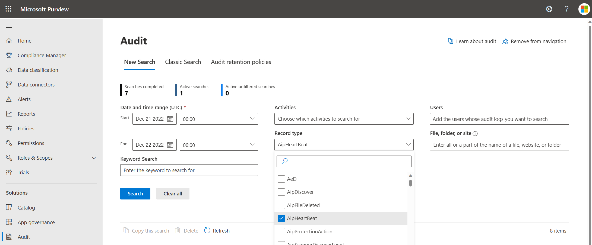
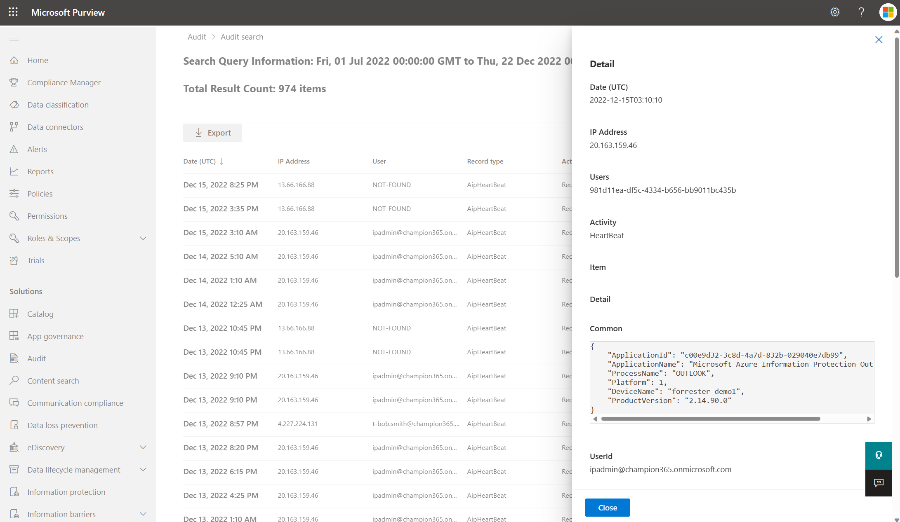

# AipHeartBeat

Azure Information Protection is a service that allows organizations to classify and label sensitive data, and apply policies to control how that data is accessed and shared.

AipHeartBeat is a type of event that is recorded in the Office 365 Unified Audit Log. AipHeartBeat events are generated automatically and are useful for tracking the health and status of the AIP service.

## Access the Office 365 Unified Audit Log

The audit logs can be accessed using the following methods:

- The [audit log search tool](#audit-log-search-tool) in the Microsoft Purview compliance portal.
- The [Search-UnifiedAuditLog](#search-unified-audit-log-in-powershell) cmdlet in Exchange Online PowerShell.
- The [Office 365 Management Activity API](#office-365-management-activity-api).

### Audit log search tool

1. Go to the [Microsoft Purview compliance portal](https://sip.compliance.microsoft.com/homepage) and sign in.
2. In the left pane of the compliance portal, select **Audit**.
   > [!Note]
   > If you don't see **Audit** in the left pane, see [Roles and role groups in Microsoft Defender for Office 365 and Microsoft Purview compliance](/microsoft-365/security/office-365-security/scc-permissions?view=o365-worldwide) for information about permissions.
3. On the Search tab, set Record type to **AipHeartBeat** and configure the other parameters.

4. Select Search to run the search using the criteria. Click an event to view the results.


For more information on viewing the audit logs in the Microsoft Purview compliance portal, see [Audit log activities](/microsoft-365/compliance/audit-log-activities).

### Search Unified Audit Log in PowerShell

To access the Unified Audit Log using PowerShell, first connect to an Exchange Online PowerShell session by completing the following steps.

### Establish a remote PowerShell session

This will establish a remote PowerShell session with Exchange Online. Once the connection is established, you can run Exchange Online cmdlets to manage your Exchange Online environment.

Open a PowerShell window and run the Install-Module -Name ExchangeOnlineManagement command to install the Exchange Online Management module. This module provides cmdlets that can be used to manage Exchange Online.

1. Connect-IPPSSession is a PowerShell cmdlet used to create a remote connection to an Exchange Online PowerShell session.
2. Import-Module ExchangeOnlineManagement is a PowerShell cmdlet used to import the Exchange Online Management module into the current PowerShell session.

```powershell
# Import the PSSSession and Exchange Online cmdlets
Connect-IPPSSession
Import-Module ExchangeOnlineManagement
```

#### Connect with a specific user

Command to prompt for a specific user for your Exchange Online credentials.

```powershell
$UserCredential = Get-Credential 
```

Command to connect to Exchange Online using the provided credentials.

```powershell
 Connect-ExchangeOnline -Credential $UserCredential -ShowProgress $true 
```

#### Connect with credentials in the current session

Connect to Exchange Online using the credentials in the current session

```powershell
Connect-ExchangeOnline
```

## Search-UnifiedAuditLog cmdlet

The Search-UnifiedAuditLog cmdlet is a PowerShell command that can be used to search the Office 365 Unified Audit Log. The Unified Audit Log is a record of user and administrator activity in Office 365 that can be used to track events. For best practices on using this cmdlet, see [Best Practices for using Search-UnifiedAuditLog](aip-unified-audit-logs-best-practices.md).

To extract the AipHeartBeat events from the Unified Audit Log using PowerShell, you can use the following command. This will search the Unified Audit Log for the specified date range and return any events with the record type "AipHeartBeat". The results will be exported to a CSV file at the specified path.

```powershell
Search-UnifiedAuditLog -RecordType AipHeartBeat -StartDate (Get-Date).AddDays(-7) -EndDate (Get-Date) | Export-Csv -Path <output file>
```

### AipHeartBeat event from PowerShell

The following is an example of a AipHeartBeat event from PowerShell.

```powershell
RecordType   : AipHeartBeat
CreationDate : 12/22/2022 8:50:10 PM
UserIds      : ipadmin@champion365.onmicrosoft.com
Operations   : HeartBeat
AuditData    : 
{
  "Common":{
    "ApplicationId":"c00e9d32-3c8d-4a7d-832b-029040e7db99",
    "ApplicationName":"Microsoft Azure Information Protection Explorer Extension",
    "ProcessName":"MSIP.App",
    "Platform":1,
    "DeviceName":"marketing-demo1",
    "ProductVersion":"2.14.90.0"
  },
  "UserId":"ipadmin@champion365.onmicrosoft.com",
  "ClientIP":"20.163.159.46",
  "Id":"2e7b94ee-92f7-480f-8b14-89d4bc0c0e43",
  "RecordType":97,
  "CreationTime":"2022-12-22T20:50:10",
  "Operation":"HeartBeat",
  "OrganizationId":"c8085975-d882-42d2-9193-d82d752a5de9",
  "UserType":0,
  "UserKey":"981d11ea-df5c-4334-b656-bb9011bc435b",
  "Workload":"Aip",
  "Version":1,
  "Scope":1
}
ResultIndex  : 9
ResultCount  : 11
Identity     : 2e7b94ee-92f7-480f-8b14-89d4bc0c0e43
IsValid      : True
ObjectState  : Unchanged
```

> [!NOTE]
> This is just an example of how the Search-UnifiedAuditLog cmdlet can be used. You may need to adjust the command and specify additional parameters based on your specific requirements. For more information on using PowerShell for unified audit logs, see [search unified audit log](/powershell/module/exchange/search-unifiedauditlog).

## Office 365 Management Activity API

In order to be able to query the Office 365 Management API endpoints, you'll need to configure your application with the right permissions. For a step-by-step guide, see [Get started with Office 365 Management APIs](https://learn.microsoft.com/office/office-365-management-api/get-started-with-office-365-management-apis).

### AipHeartBeat event from REST API

The following is an example of a AipHeartBeat event from REST API.

```
TenantId : bd285ff7-1a38-4306-adaf-a367669731c3
SourceSystem : RestAPI
TimeGenerated [UTC] : 2022-12-21T17:18:20Z
EventCreationTime [UTC] : 2022-12-21T17:18:20Z
Id : a5ee064a-9508-4332-9853-db4bc8813f4c
Operation : HeartBeat
OrganizationId : ac1dff03-7e0e-4ac8-a4c9-9b38d24f062c
RecordType : 97
UserType : 0
Version : 1
Workload : Aip
UserId : mipscanner@kazdemos.org
UserKey : 2231a98d-8749-4808-b461-1acaa5b628ac
Scope : 1
ClientIP : 52.159.112.221
Common_ApplicationId : c00e9d32-3c8d-4a7d-832b-029040e7db99
Common_ApplicationName : Microsoft Azure Information Protection Explorer Extension
Common_ProcessName : MSIP.App
Common_Platform : 1
Common_DeviceName : AIPSCANNER1.mscompliance.click
Common_ProductVersion : 2.14.90.0
Type : AuditGeneral
```

## Attributes of the AipHeartBeat event

Event | Type | Description
---|---|---
ApplicationId | GUID | The ID of the application performing the operation.
ApplicationName | String | Friendly name of the application performing the operation. (Outlook, OWA, Word, Excel, PowerPoint, etc.)
ClientIP | IPv4/IPv6 | The IP address of the device that was used when the activity was logged. For some services, the value displayed in this property might be the IP address for a trusted application (for example, Office on the web apps) calling into the service on behalf of a user and not the IP address of the device used by person who performed the activity.
CreationTime | Date/time | The date and time in Coordinated Universal Time (UTC) when the user performed the activity.
DeviceName | String | The device on which the activity happened.
Id | GUID | Unique identifier of an audit record.
Operation | String | The operation type for the audit log (Heartbeat)
OrganizationId | GUID | The GUID for your organization's Office 365 tenant. This value will always be the same for your organization, regardless of the Office 365 service in which it occurs.
Platform | Double | The platform where the activity occurred from. </br>0 = Unknown</br>1 = Windows</br>2 = MacOS </br>3 = iOS</br>4 = Android</br>5 = Web Browser
ProcessName | String | The relevant process name (Outlook, MSIP.App, WinWord, etc.)
ProductVersion | String | Version of the AIP client.
RecordType | Double | The type of operation indicated by the record. 97 represents an AipHeartBeat record.
Scope | Double | 0 represents that the event was created by a hosted O365 service. 1 represents that the event was created by an on-premises server.
UserId | String | The User Principal Name (UPN) of the user who performed the action that resulted in the record being logged.
UserKey | GUID | An alternative ID for the user identified in the UserId property. This property is populated with the passport unique ID (PUID) for events performed by users in SharePoint, OneDrive for Business, and Exchange.
UserType | Double | The type of user that performed the operation. </br>0 = Regular</br>1 = Reserved</br>2 = Admin </br>3 = DcAdmin</br>4 = System</br>5 = Application</br>6 = ServicePrincipal</br>7 = CustomPolicy</br>8 = SystemPolicy
Version | Double | Version ID of the file in the operation.
Workload | String | Stores the Office 365 service where the activity occurred (Exchange, SharePoint, OneDrive, etc).
