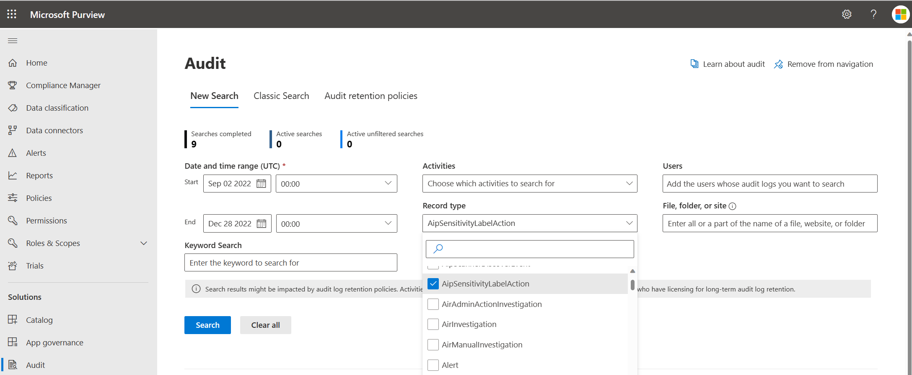
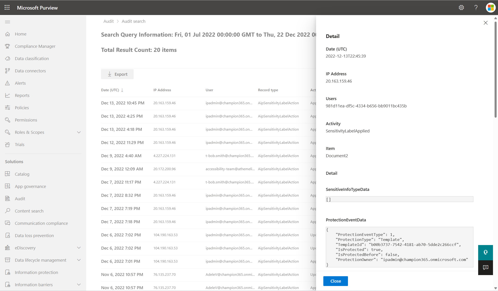

# AipSensitivityLabelAction

Azure Information Protection is a service that allows organizations to classify and label sensitive data, and apply policies to control how that data is accessed and shared.

AipSensitivityLabelAction is a type of event that is recorded in the Office 365 Unified Audit Log. It represents an attempt to apply or modify a sensitiviy label. Some of the scenarios included within this audit log include applying a label, updating a label, removing a label, and opening a file with a label. The event is useful because it shows how labeled data is being changed within an organization. 

## Access the Office 365 Unified Audit Log

The audit logs can be accessed using the following methods:
- The [audit log search tool](#audit-log-search-tool) in the Microsoft Purview compliance portal.
- The [Search-UnifiedAuditLog](#search-unified-audit-log-in-powershell) cmdlet in Exchange Online PowerShell.
- The [Office 365 Management Activity API](/office/office-365-management-api/office-365-management-activity-api-reference).

### Audit log search tool

1. Go to https://compliance.microsoft.com and sign in.
2. In the left pane of the compliance portal, select Audit.
3. On the Search tab, set Record type to **AipSensitivityLabelAction** and configure the other parameters.
 
1. Select Search to run the search using the critera. Click on an event to view the results.
 

For more information on the Audit log search tool, see [audit log search tool](audit-log-search.md).

## Search Unified Audit Log in PowerShell

To access the Unified Audit Log using PowerShell, first connect to an Exchange Online PowerShell session by completing the following steps.

### Establish remote Powershell session

This will establish a remote PowerShell session with Exchange Online. Once the connection is established, you can run Exchange Online cmdlets to manage your Exchange Online environment. 

Open a PowerShell window and run the Install-Module -Name ExchangeOnlineManagement command to install the Exchange Online Management module. This module provides cmdlets that can be used to manage Exchange Online.

1. Connect-IPPSSession is a PowerShell cmdlet used to create a remote connection to an Exchange Online PowerShell session.
2. Import-Module ExchangeOnlineManagement is a PowerShell cmdlet used to import the Exchange Online Management module into the current PowerShell session.

```powershell
# Import the PSSSession and Exchange Online cmdlets
Connect-IPPSSession
Import-Module ExchangeOnlineManagement
```

#### Connect with a specific user. 

Command to prompt for a specific user for  your Exchange Online credentials.

```powershell
$UserCredential = Get-Credential 
```

Command to connect to Exchange Online using the provided credentials. 

```powershell
 Connect-ExchangeOnline -Credential $UserCredential -ShowProgress $true 
```

#### Connect with credentials in the current session

Connect to Exchange Online using the credentials in the current session.

```powershell
Connect-ExchangeOnline
```

### Search-UnifiedAuditLog cmdlet

The Search-UnifiedAuditLog cmdlet is a PowerShell command that can be used to search the Office 365 Unified Audit Log. The Unified Audit Log is a record of user and administrator activity in Office 365 that can be used to track events. For best practices on using this cmdlet, see [Best Practices for using Search-UnifiedAuditLog](BestPractices)

To extract the AipSensitivityLabelAction events from the Unified Audit Log using PowerShell, you can use the following command. This will search the Unified Audit Log for the specified date range and return any events with the record type "AipSensitivityLabelAction". The results will be exported to a CSV file at the specified path.

```powershell
Search-UnifiedAuditLog -RecordType AipSensitivityLabelAction -StartDate (Get-Date).AddDays(-100) -EndDate (Get-Date) | Export-Csv -Path <output file>
```

Use the following command to specifically search for the scenario in which the sensitivity label was applied. An example of the result of the PowerShell cmdlet is also shown below.

```powershell
Search-UnifiedAuditLog -Operations SensitivityLabelApplied -RecordType AipSensitivityLabelAction -StartDate (Get-Date).AddDays(-100) -EndDate (Get-Date)
```

The following is an example of SensitivityLabelApplied event from PowerShell, with sensitivity label applied.

```
RecordType   : AipSensitivityLabelAction
CreationDate : 12/13/2022 10:45:39 PM
UserIds      : ipadmin@champion365.onmicrosoft.com
Operations   : SensitivityLabelApplied
AuditData    : 
{
  "SensitiveInfoTypeData":[],
  "ProtectionEventData":{
    "ProtectionEventType":1,
    "ProtectionType":"Template",
    "TemplateId":"b00b3737-7542-4181-ab70-5dde2c266ccf",
    "IsProtected":true,
    "IsProtectedBefore":false,
    "ProtectionOwner":"ipadmin@champion365.onmicrosoft.com"
  },
  "Common":{
    "ApplicationId":"c00e9d32-3c8d-4a7d-832b-029040e7db99",
    "ApplicationName":"Microsoft Azure Information Protection Word Add-In",
    "ProcessName":"WINWORD",
    "Platform":1,
    "DeviceName":"marketing-demo1",
    "Location":"On-premises file shares",
    "ProductVersion":"2.14.90.0"
  },
  "DataState":"Use",
  "SensitivityLabelEventData":{
    "SensitivityLabelId":"4eff011f-95b3-4371-8836-39da6458f464",
    "LabelEventType":4,
    "ActionSource":1
  },
  "ObjectId":"Document2",
  "UserId":"ipadmin@champion365.onmicrosoft.com",
  "ClientIP":"20.163.159.46",
  "Id":"77b9a81f-aa2a-4e4a-bdb7-d35b03277fec",
  "RecordType":94,
  "CreationTime":"2022-12-13T22:45:39",
  "Operation":"SensitivityLabelApplied",
  "OrganizationId":"c8085975-d882-42d2-9193-d82d752a5de9",
  "UserType":0,
  "UserKey":"981d11ea-df5c-4334-b656-bb9011bc435b",
  "Workload":"Aip",
  "Version":1,
  "Scope":1
}
ResultIndex  : 1
ResultCount  : 13
Identity     : 77b9a81f-aa2a-4e4a-bdb7-d35b03277fec
IsValid      : True
ObjectState  : Unchanged
```

Use the following command to specifically search for the scenario in which the sensitivity label was updated. An example of the result of the PowerShell cmdlet is also shown below.

```powershell
Search-UnifiedAuditLog -Operations SensitivityLabelUpdated -RecordType AipSensitivityLabelAction -StartDate (Get-Date).AddDays(-100) -EndDate (Get-Date)
```

The following is an example of AipSensitivityLabelAction event from PowerShell, with sensitivity label updated.

```
RecordType   : AipSensitivityLabelAction
CreationDate : 12/22/2022 9:01:35 PM
UserIds      : ipadmin@champion365.onmicrosoft.com
Operations   : SensitivityLabelUpdated
AuditData    : RecordType:AipSensitivityLabelAction
CreationDate:12/22/2022 9:01:35 PM
UserIds:ipadmin@champion365.onmicrosoft.com
Operations:SensitivityLabelUpdated
AuditData:
{
  "SensitiveInfoTypeData":[],
  "ProtectionEventData":{
    "ProtectionEventType":1,
    "ProtectionType":"DoNotForward",
    "IsProtected":true,
    "IsProtectedBefore":false,
    "ProtectionOwner":"ipadmin@champion365.onmicrosoft.com"
  },
  "Common":{
    "ApplicationId":"c00e9d32-3c8d-4a7d-832b-029040e7db99",
    "ApplicationName":"Microsoft Azure Information Protection Outlook Add-In",
    "ProcessName":"OUTLOOK",
    "Platform":1,
    "DeviceName":"forrester-demo1",
    "Location":"On-premises file shares",
    "ProductVersion":"2.14.90.0"
  },
  "DataState":"Use",
  "SensitivityLabelEventData":{
    "SensitivityLabelId":"6a10f3c2-a682-44ba-a911-52dcca64e78d",
    "OldSensitivityLabelId":"6282649d-9e2a-4063-8587-32eaaa9ad68e",
    "LabelEventType":1,
    "ActionSource":3
  },
  "ObjectId":"test.msg",
  "UserId":"ipadmin@champion365.onmicrosoft.com",
  "ClientIP":"20.163.159.46",
  "Id":"ca08441d-7876-4320-9c75-c0a3d99bcc4a",
  "RecordType":94,
  "CreationTime":"2022-12-22T21:01:35",
  "Operation":"SensitivityLabelUpdated",
  "OrganizationId":"c8085975-d882-42d2-9193-d82d752a5de9",
  "UserType":0,
  "UserKey":"981d11ea-df5c-4334-b656-bb9011bc435b",
  "Workload":"Aip",
  "Version":1,
  "Scope":1
}
ResultIndex:1
ResultCount:6
Identity:ca08441d-7876-4320-9c75-c0a3d99bcc4a
IsValid:True
ObjectState:Unchanged
ResultIndex  : 1
ResultCount  : 6
Identity     : ca08441d-7876-4320-9c75-c0a3d99bcc4a
IsValid      : True
ObjectState  : Unchanged
```

The other operations that can be specifically searched for within AipSensitivityLabelAction include SensitivityLabelRemoved, SensitivityLabelPolicyMatched, and SensitivityLabeledFileOpened. 

> [!NOTE]
> This is just an example of how the Search-UnifiedAuditLog cmdlet can be used. You may need to adjust the command and specify additional parameters based on your specific requirements. For more information on using PowerShell for unified audit logs, see [search unified audit log](/powershell/module/exchange/search-unifiedauditlog).

## Office 365 Management Activity API

In order to be able to query the Office 365 Management API endpoints, you will need to configure your application with the right permissions. For a step-by-step guide, see [Get started with Office 365 Management APIs](https://learn.microsoft.com/en-us/office/office-365-management-api/get-started-with-office-365-management-apis).

### AipSensitivityLabelAction event from REST API

The following is an example of AipSensitivityLabelAction event from REST API.

```
TenantId : bd285ff7-1a38-4306-adaf-a367669731c3
SourceSystem : RestAPI
TimeGenerated [UTC] : 2022-12-07T18:04:40Z
EventCreationTime [UTC] : 2022-12-07T18:04:40Z
ProtectionEventData_ProtectionEventType : 1
Id : e22455c0-3f3e-4983-8067-adf7aebac2b7
Operation : SensitivityLabelApplied
OrganizationId : ac1dff03-7e0e-4ac8-a4c9-9b38d24f062c
RecordType : 94
UserType : 5
Version : 1
Workload : Aip
UserId : mipscanner@kazdemos.org
UserKey : 2231a98d-8749-4808-b461-1acaa5b628ac
Scope : 1
ClientIP : 168.245.201.7
Common_ApplicationId : c00e9d32-3c8d-4a7d-832b-029040e7db99
Common_ApplicationName : Microsoft Azure Information Protection Scanner
Common_ProcessName : MSIP.Scanner
Common_Platform : 1
Common_DeviceName : AIPConnector.AIPTest.local
Common_ProductVersion : 2.14.90.0
ObjectId : c:\Data\Data03\Concert Schedule.docx
SensitivityLabelEventData_ActionSource : 3
SensitivityLabelEventData_LabelEventType : 4
SensitivityLabelEventData_SensitivityLabelId : 14332bd2-1fed-4838-954b-646f71db45b1
SensitiveInfoTypeData : []
ProtectionEventData_ProtectionType : Template
ProtectionEventData_TemplateId : 7ef1852d-f4a9-460a-a59f-60ee8c3fe291
ProtectionEventData_IsProtected : true
ProtectionEventData_ProtectionOwner : mipscanner@kazdemos.org
Common_Location : On-premises file shares
DataState : Rest
ProtectionEventData_IsProtectedBefore : false
Type : AuditGeneral
```

## Attributes of the AipSensitivityLabelAction event

The following table contains information related to AIP sensitivity label events.

Event | Type | Description
---|---|---
ActionSource | Double | Indicates whether the label was applied manually or automatically. </br>0 = None</br>1 = Default</br>2 = Auto </br>3 = Manual</br>4 = Recommended
ApplicationId	| GUID | The ID of the application performing the operation.
ApplicationName | String | Friendly name of the application performing the operation. (Outlook, OWA, Word, Excel, PowerPoint, etc.)
ClientIP | IPv4/IPv6 | The IP address of the device that was used when the activity was logged. For some services, the value displayed in this property might be the IP address for a trusted application (for example, Office on the web apps) calling into the service on behalf of a user and not the IP address of the device used by person who performed the activity.
CreationTime | Date/time | The date and time in Coordinated Universal Time (UTC) when the user performed the activity.
DataState | String | Describes if the data is at rest or in use.
DeviceName | String | The device on which the activity happened.
Id | GUID | Unique identifier of an audit record.
IsProtected | Boolean | States whether or not the data is protected with encryption.
LabelEventType | Double | Describes how the label was changed. </br>0 = None</br>1 = LabelUpgraded</br>2 = LabelDowngraded </br>3 = LabelRemoved</br>4 = LabelChangedSameOrder
Location | String | The location of the document with respect to the user's device.
ObjectId | String | File full path (URL) that is being accessed by the user.
OldSensitivityLabelId | GUID | The previous sensitivity label GUID.
Operation | String | The operation type for the audit log. For AipSensitivityLabelAction, operations can include: </br>- SensitivityLabelApplied </br>- SensitivityLabelUpdated </br>- SensitivityLabelRemoved </br>- SensitivityLabelPolicyMatched </br>- SensitivityLabeledFileOpened
OrganizationId | GUID | The GUID for your organization's Office 365 tenant. This value will always be the same for your organization, regardless of the Office 365 service in which it occurs.                                            
Platform | Double | The platform where the activity occurred from. </br>0 = Unknown</br>1 = Windows</br>2 = MacOS </br>3 = iOS</br>4 = Android</br>5 = Web Browser
ProcessName | String | The relevant process name (Outlook, MSIP.App, WinWord, etc.) 
ProductVersion | String | Version of the AIP client.
ProtectionOwner | String | Rights Management owner in UPN format.
ProtectionType | String | The type of protection that was used for the data (Template, Custom, etc.)
RecordType | Double | The type of operation indicated by the record. 94 represents an AipSensitivityLabelAction record.
Scope | Double | 0 represents that the event was created by a hosted O365 service. 1 represents that the event was created by an on-premises server.                                            
SensitiveInfoTypeData | String | The sensitive information types that have been discovered within the data.
SensitivityLabelId | GUID | The current sensitivity label GUID. Use cmdlt Get-Label to get the full values of the GUID.
TemplateId | GUID | The id for the template used for protection. The Get-AipServiceTemplate cmdlet gets all existing or selected protection templates from Azure Information Protection.                                        
UserId | String | The User Principal Name (UPN) of the user who performed the action that resulted in the record being logged.
UserKey | GUID | An alternative ID for the user identified in the UserId property. This property is populated with the passport unique ID (PUID) for events performed by users in SharePoint, OneDrive for Business, and Exchange.           
UserType | Double | The type of user that performed the operation. </br>0 = Regular</br>1 = Reserved</br>2 = Admin </br>3 = DcAdmin</br>4 = Systeml</br>5 = Application</br>6 = ServicePrincipal</br>7 = CustomPolicy</br>8 = SystemPolicy  
Version | Double | Version ID of the file in the operation.                      
Workload | String | Stores the Office 365 service where the activity occurred (Exchange, SharePoint, OneDrive, etc). 
