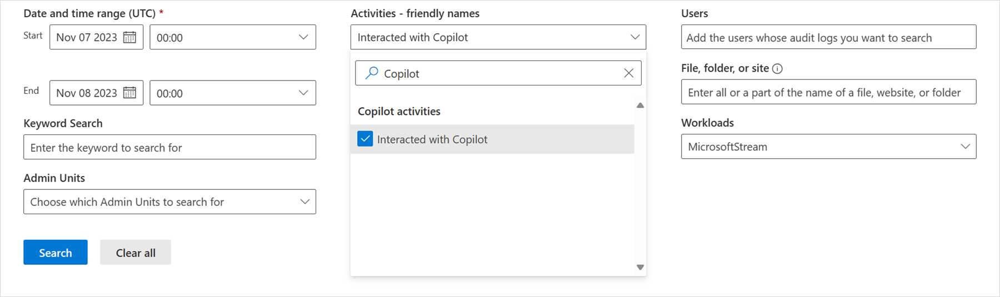

# Copilot interaction events overview

For [auditing](/purview/audit-solutions-overview), details are [captured](/purview/audit-log-activities#copilot-activities) when users interact with Copilot. Events include how and when users interact with Copilot, in which Microsoft 365 service the activity took place, and references to the files stored in Microsoft 365 that were accessed during the interaction. If these files have a sensitivity label applied, that's also captured.  

Copilot events can be accessed in the **Audit** solution from the Microsoft Purview compliance portal. To search for copilot events, select **Copilot activities** and **Interacted with Copilot**. You can also select **Copilot** as a workload. More information on searching the audit log can be found in [Audit New Search](/purview/audit-new-search).  



## Schema example

```xml
<edmx:DataServices>
        <Schema Namespace="Microsoft.Office.Audit.Schema.CopilotInteraction" xmlns="http://docs.oasis-open.org/odata/ns/edm">
            <ComplexType Name="SensitivityLabelIdData">
                <Property Name="Id" Type="Edm.String">
                    <Annotation Term="Microsoft.Office.Audit.Schema.PIIFlag" Bool="true"/>
                </Property>
                <Property Name="SiteUrl" Type="Edm.String">
                    <Annotation Term="Microsoft.Office.Audit.Schema.PIIFlag" Bool="true"/>
                </Property>
                <Property Name="listItemUniqueId" Type="Edm.String"/>
                <Property Name="Type" Type="Edm.String"/>
                <Property Name="Name" Type="Edm.String">
                    <Annotation Term="Microsoft.Office.Audit.Schema.PIIFlag" Bool="true"/>
                </Property>
                <Property Name="SensitivityLabelId" Type="Edm.String"/>
                <Property Name="Action" Type="Edm.String"/>
            </ComplexType>

            <ComplexType Name="CopilotId">
                <Property Name="Id" Type="Edm.String">
                    <Annotation Term="Microsoft.Office.Audit.Schema.PIIFlag" Bool="true"/>
                </Property>
                <Property Name="Type" Type="Edm.String"/>
                <Property Name="ContainerId" Type="Edm.String"/>
            </ComplexType>

            <ComplexType Name="MessageData">
                <Property Name="Id" Type="Edm.String">
                    <Annotation Term="Microsoft.Office.Audit.Schema.PIIFlag" Bool="true"/>
                </Property>
                <Property Name="Size" Type="Edm.Int64"/>
                <Property Name="isPrompt" Type="Edm.Boolean"/>
            </ComplexType>

            <ComplexType Name="ModelTransparencyDetail">
                <Property Name="ModelProviderName" Type="Edm.String"/>
                <Property Name="ModelName" Type="Edm.String"/>
                <Property Name="ModelVersion" Type="Edm.String"/>
            </ComplexType>

            <ComplexType Name="AISystemPluginData">
                <Property Name="Name" Type="Edm.String">
                    <Annotation Term="Microsoft.Office.Audit.Schema.PIIFlag" Bool="true"/>
                </Property>
                <Property Name="Id" Type="Edm.String">
                    <Annotation Term="Microsoft.Office.Audit.Schema.PIIFlag" Bool="true"/>
                </Property>
                <Property Name="Version" Type="Edm.String"/>
            </ComplexType>

            <ComplexType Name="EventData">
                <Property Name="AppHost" Type="Edm.String" />
                <Property Name="Contexts" Type="Collection(Self.CopilotId)" />
                <Property Name="ThreadId" Type="Edm.String" />
                <Property Name="MessageIds" Type="Collection(Edm.String)" />
                <Property Name="Messages" Type="Collection(Self.MessageData)" />
                <Property Name="AccessedResources" Type="Collection(Self.SensitivityLabelIdData)" />
                <Property Name="ModelTransparencyDetails" Type="Collection(Self.ModelTransparencyDetail)"/>
                <Property Name="AISystemPlugin" Type="Collection(Self.AISystemPluginData)"/>
            </ComplexType>

            <EntityType Name="CopilotInteractionAuditRecord" BaseType="AuditRecord" >
                <Annotation Term="Microsoft.Office.Audit.Schema.WorkloadType" EnumMember="Microsoft.Office.Audit.Schema.WorkloadType/Copilot"/>
                <Property Name="CopilotEventData" Type="Self.EventData" />
                <Property Name="ClientRegion" Type="Edm.String" />
                <Property Name="CopilotLogVersion" Type="Edm.String" />
            </EntityType>
        </Schema>
    </edmx:DataServices>
```

## Audit log examples of CopilotInteraction 

Copilot Interaction logs provide information regarding the RecordID, CreationDate, RecordType, Operation, UserID, and the Audit Data field. The Audit Data field will include any additional information based on the context of user interaction with Copilot, which can include the AppHost, Contexts, ThreadID, MessageIDs, and AccessedResources. More information regarding each of these copilot schema properties can be found in the Audit copilot schema definition section. 

Example 1: Copilot Interaction Experience within M365 Apps (e.g. Word)
- RecordID: 99b0a960-13a0-461f-8c5c-cb2316ea273d
- CreationDate: 12/13/2023 17:12
- RecordType: 261
- Operation: CopilotInteraction
- UserID: admin@MODERNCOMMS975184.onmicrosoft.com
- AuditData: {"CreationTime":"2023-12-13T17:12:36","Id":"99b0a960-13a0-461f-8c5c-cb2316ea273d","Operation":"CopilotInteraction","OrganizationId":"408e31c8-8f05-410a-9221-84335f0ce512","RecordType":261,"UserKey":"12d24f71-64c7-49b3-821f-f8884f3f373e","UserType":0,"Version":1,"Workload":"Copilot","ClientIP":"ffff:10.11.0.229","ClientRegion":"US","UserId":"admin@MODERNCOMMS975184.onmicrosoft.com","CopilotEventData":{"AISystemPlugin":[],"AccessedResources":[],"AppHost":"Word","Contexts":[{"Id":"https:\/\/moderncomms975184-my.sharepoint.com\/personal\/admin_moderncomms975184_onmicrosoft_com\/_layouts\/15\/Doc.aspx?sourcedoc=%7B9FDE1491-B079-4180-9B1E-B87F4ACA19F7%7D&file=AboutElephants.docx&action=default&mobileredirect=true","Type":"docx"}],"MessageIds":[],"Messages":[{"Id":"1715187560311","isPrompt":true},{"Id":"1715187561014","isPrompt":false}],"ModelTransparencyDetails":[],"ThreadId":"19:lgojcxwbvhJnfU3IhUJW5M-nSX2U7tjccgSrtYAoG341@thread.v2"}}

Example 2: Copilot Interaction within M365 Chat Experience on Bing
- RecordID: 537312b6-dce7-4d9b-8b12-58283204b720
- CreationDate: 12/14/2023 2:11	
- RecordType: 261
- Operation: CopilotInteraction
- UserID: admin@MODERNCOMMS975184.onmicrosoft.com
- AuditData: {"CreationTime":"2023-12-14T02:11:55","Id":"537312b6-dce7-4d9b-8b12-58283204b720","Operation":"CopilotInteraction","OrganizationId":"408e31c8-8f05-410a-9221-84335f0ce512","RecordType":261,"UserKey":"12d24f71-64c7-49b3-821f-f8884f3f373e","UserType":0,"Version":1,"Workload":"Copilot","ClientIP":"2401:4900:60d2:179b:c004:b6f:b678:b148","ClientRegion":"IN","UserId":"admin@MODERNCOMMS975184.onmicrosoft.com","CopilotEventData":{"AISystemPlugin":[{"Id":"BingWebSearch","Name":"BuiltIn"}],"AccessedResources":[{"Action":"Read","Id":"AAAAAEYE2GAACp1FlnN_CHXStUkHAGWJYgtgcv1eOxe2v4H4jOsAAAQsLLeAAGWJYgtgcv1EoXe2v4H4josAABwvq8gAAA2","Name":"Document1.docx","SensitivityLabelId":"f41ab342-8706-4188-bd11-ebb85995028c","SiteUrl":"https:\/\/microsoft.sharepoint.com\/teams\/OfficeSerbia\/Shared%20Documents\/SPOPPE\/Document%20transformation%20services\/Crawled%20Word%20documents\/IW\/Document1.docx?web=1","Type":"docx","listItemUniqueId":"AAAAAEYE2GAACp1FlnN_CHXStUkHAGWJYgtgcv1eOxe2v4H4jOsAAAQsLLeAAGWJYgtgcv1EoXe2v4H4josAABwvq8gAAA2"}],"AppHost":"Bing","Contexts":[],"MessageIds":[],"Messages":[{"Id":"1715186983849","isPrompt":true},{"Id":"1715186984291","isPrompt":false}],"ModelTransparencyDetails":[{"ModelName":"DEEP_LEO"}],"ThreadId":"19:Xn3uQZYgZ7f2ue0vp5w9MglEVjFyp5pza1efaC6g2U41@thread.v2"}}
 
## Audit copilot schema definitions

|Attribute |Definition  |
|----------|------------|
|*ClientRegion*   |The user’s region when they performed the operation.  |
|*AISystemPlugin*    |Details of plugins or extensions enabled for the Coplot interaction.   |
|*AppHost*       |The type of Copilot used during the interaction. <br> The current list of values include Bing, Teams, Outlook, Office, DevUI, BashTool, Word, Excel, PowerPoint, OneNote, SharePoint, Loop, Whiteboard, M365App, M365AdminCenter, Planner, VivaEngage, VivaCopilot, Stream, Assist365, VivaGoals.  |
|*Contexts*     |Context contains a collection of attributes within AppChat around the user interaction to help describe where the user was during the copilot interaction. ID is  identifier of the resource that was being used during the copilot interaction. Type is the name of the app or service within context.  <br>Example: Some examples of supported apps and services include M365 Office (docx, pptx, xlsx), TeamsMeeting, TeamsChannel, and TeamsChat. If Copilot is used in Excel, then context will be the identifier of the Excel Spreadsheet and the file type. |
|*ThreadId*               |The ID of the copilot and user interaction thread.  |
|*MessageIds*            |This is currently reserved with Microsoft Internal. |
|*Messages*               |The ID of the prompt and response messages in the Copilot interaction. |
|*ModelTransparencyDetails*    |Details of the AI/GAI model provider.           |
|*AccessedResources*     |References to all the files and documents Copilot used in M365 services like OneDrive and SharePoint Online to respond to the user’s request.   |

